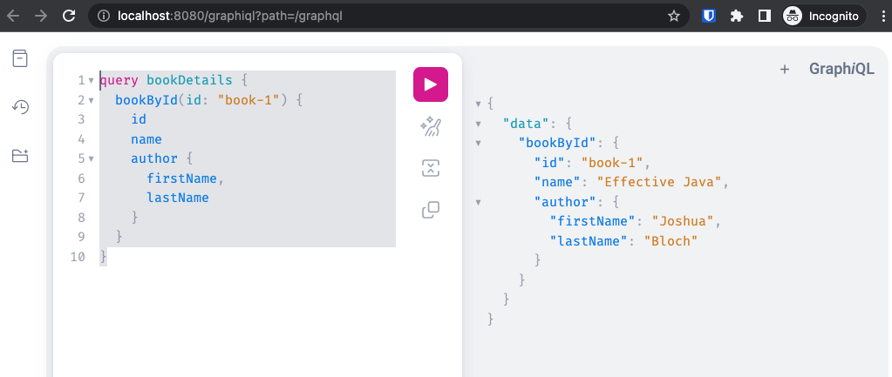

# GraphQL server with Spring Boot 3

## How to query the server

Run the application and navigate [graphql playground](http://localhost:8080/graphiql).

Execute the query:

```graphql
query bookDetails {
    bookById(id: "book-1") {
        id
        name
        author {
            firstName,
            lastName
        }
    }
}
```


